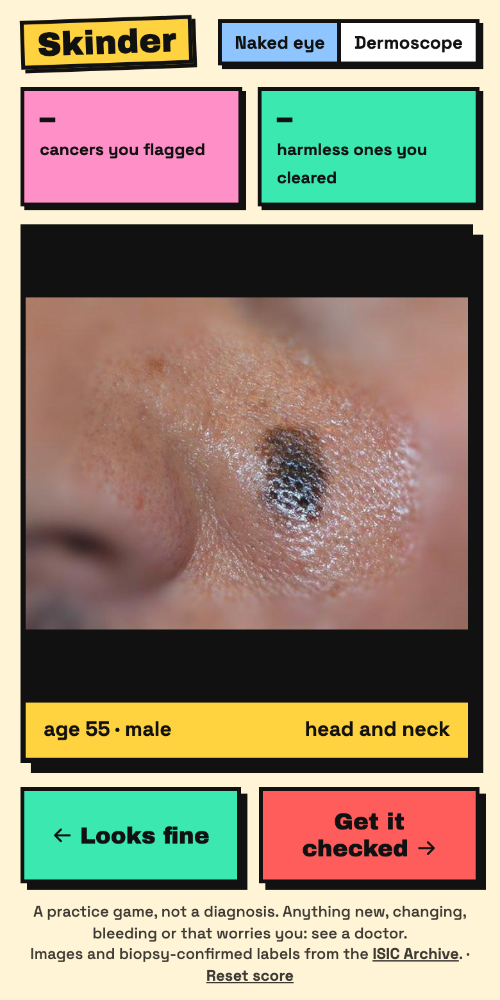
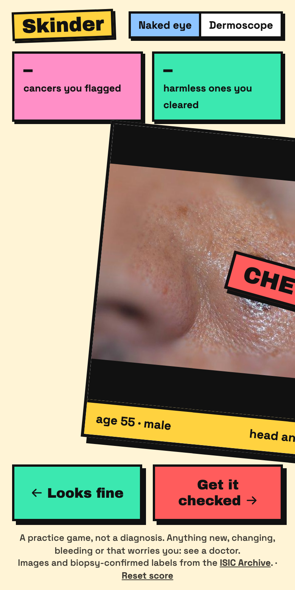
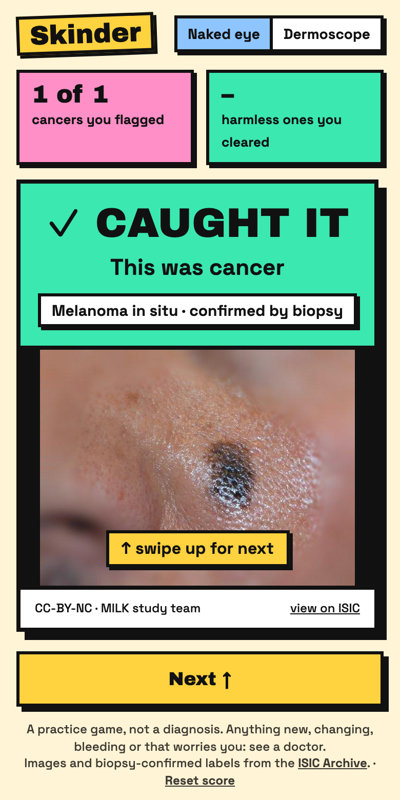

# Skinder

A swipe game for learning which skin spots are worth showing a doctor.

Skinder shows you photos of moles and skin growths that were later checked by biopsy. Swipe left if it looks fine and right if you'd get it checked, and the real answer appears straight away.

<p>
  
  
  
</p>

> **Skinder is a practice game. It doesn't diagnose anything.** If a spot on your skin worries you, see a doctor.

## What's in it

- **9,159 photos from the [ISIC Archive](https://www.isic-archive.com)**, every one confirmed by biopsy. Photos the lab couldn't call either way are left out.
- **Naked eye mode:** 6,159 ordinary close-up photos, the view you have of your own skin.
- **Dermoscope mode:** 3,000 photos through the lit magnifier a skin doctor uses.
- Each round is half cancer and half harmless. A photo you get wrong comes back once, about 30 cards later.
- No accounts and no tracking. Your score is kept in your browser.

## Limits

- Half of every round is cancer. In real life almost every spot is harmless.
- The harmless photos were suspicious enough to biopsy, so they are harder than everyday moles.
- Most naked-eye cancers are basal cell carcinoma. Melanoma practice is stronger in dermoscope mode.
- Most photos show lighter skin.

## Run it

```sh
npm install
npm start            # http://localhost:8140
```

Or `docker compose up -d`.

The photo list (`public/data/deck.json`) ships with the repo. To rebuild it from the archive:

```sh
python3 scripts/build_deck.py
```

## Layout

| Path | What it is |
|---|---|
| `public/` | The game: one HTML page and one script |
| `site/` | The project page |
| `scripts/build_deck.py` | Fetches biopsy-confirmed photos from the ISIC API |
| `server.mjs` | Small Express server. Serves the game at `/` and the project page at `/about/` |

## Credits

Images and diagnoses come from the ISIC Archive under the CC-0, CC-BY or CC-BY-NC license shown on each photo. Each answer card credits the photo's source and links to it. The screenshots above include ISIC images credited to the MILK study team (CC-BY-NC).

Code is MIT licensed.
